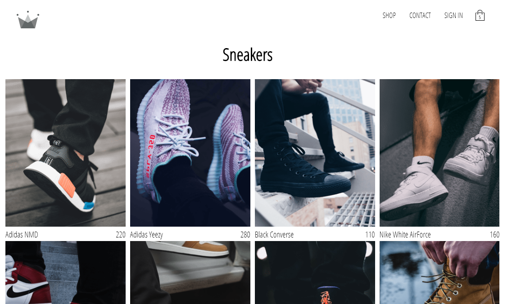

## RSTY Clothing

## Link to Deployed Site
https://rsty-clothing.herokuapp.com

## Description
******************
This is an ecommerce website where users may shop for clothing.  The front end was build with React framework with Redux for state management and Redux Saga to make asychronous api calls.  

The backed uses a simple server built with Node and Express to access the Stripe API and process payments.  The shop data is stored in Google Firestore and user authentication was established using Firebase. 

## Installation
*********
To contribute to this work simply fork and clone the repository and run yarn install.  Navigate to the client folder and run yarn install for the frontend.  To start both the server and the front end, navigate to the base folder and run yarn run dev.

## Sample
******

******

******
